<h1 align="center"> Sistema de inventario </h1>

 Sistema control de inventario con factura realizado en java.

 

## 💻 Tecnologías utilizadas
- Java
- IDE Netbeans 8.2
- Appserv   

### Abrir el proyecto

ver

### vídeo

> [Míralo aquí](https://youtu.be/8AQHI-jKS54)

## Documentación

<h2 align="center">Inicio de sesión</h2>

> __Note__
> **Acceder a la aplicación**
- **Para usuario admin**
> - usuario: señorjak
> - contraseña: 2022
- **Para usuario invitado**
> - usuario: suscriptor
> - contraseña: 1234

 Cada `usuario` tendrá un máximo de 3 `intentos` al iniciar sesión, si agota todo los intentos la aplicación procederá a cerrarse.

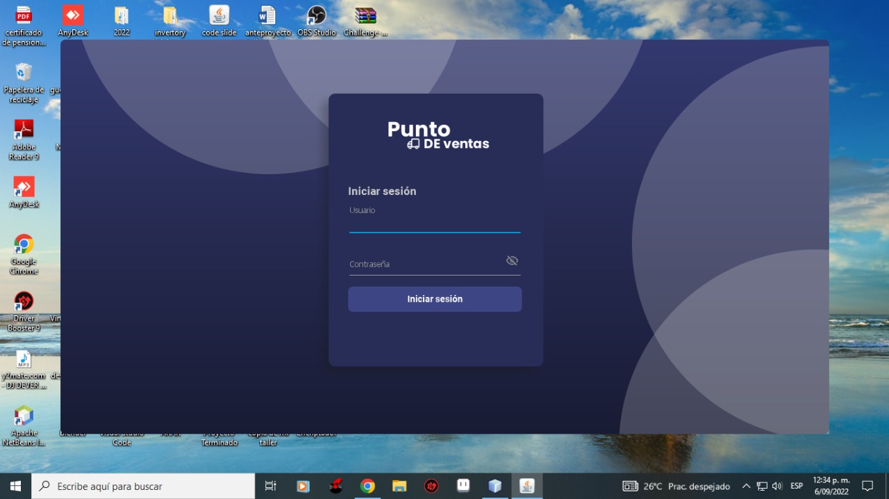

<h2 align="center"> Registro de actividad</h2>

 Este apartado se puede evidenciar la cantidad de `clientes` que existen, la cantidad de `productos` que se hayan disponible y las `ventas` que han sido realizadas. Todo de una manera visual, nada se podra modificar aquí directamente.

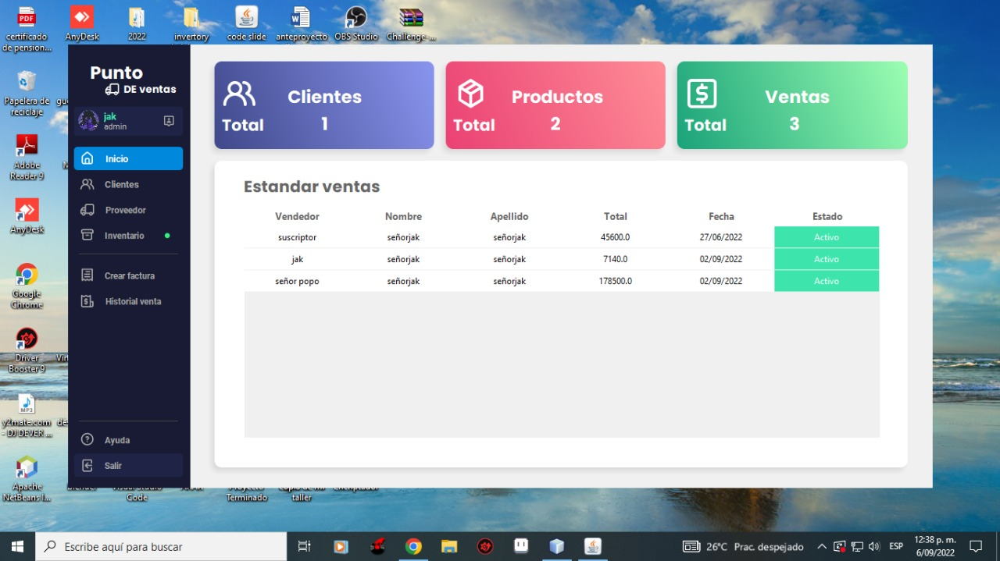

<h2 align="center"> Apartado de clientes</h2>

 En este apartado puedes hacer el registro de `nuevos clientes`, así con la disponibilidad de poder `modificarlos`, `eliminarlo` y `guardarlos.`

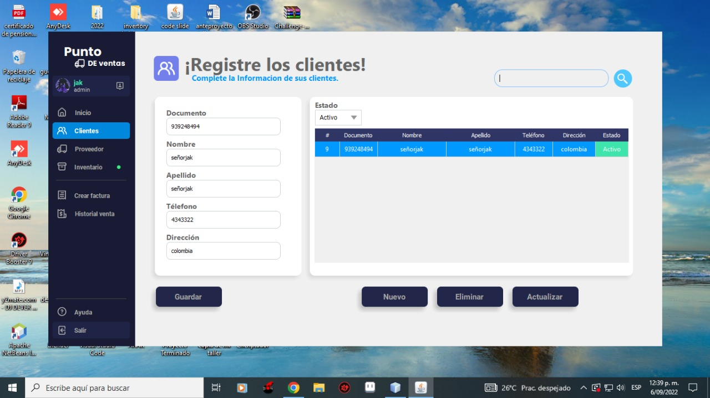

<h2 align="center">Apartado de proveedores</h2>

 En este apartado puedes hacer el registro de los `proveedores`, así con la disponibilidad de poder `modificarlos`, `eliminarlo` y `guardarlos.`

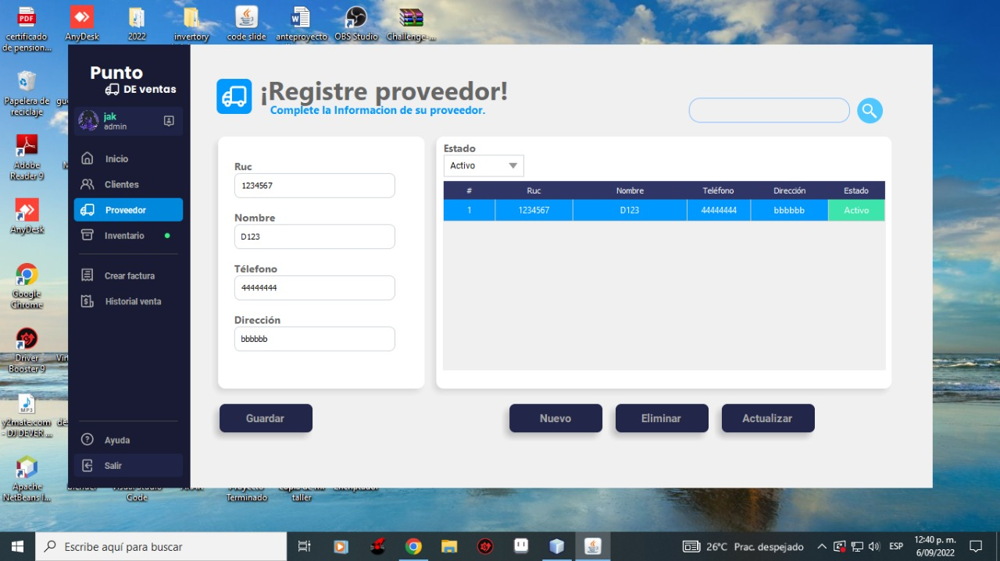

<h2 align="center">Apartado de productos</h2>

 En este apartado puedes hacer el registro de `nuevos productos`, así con la disponibilidad de poder `modificarlos`, `eliminarlo` y `guardarlos`.
También cuenta con un notificador que te indica cuando tienes productos `agotados` en tu stock, cuando el puntico se haya en verde quiere decir que hay productos completamente disponible, en caso de que no esté de color verde sabrás que tienes productos agotados.

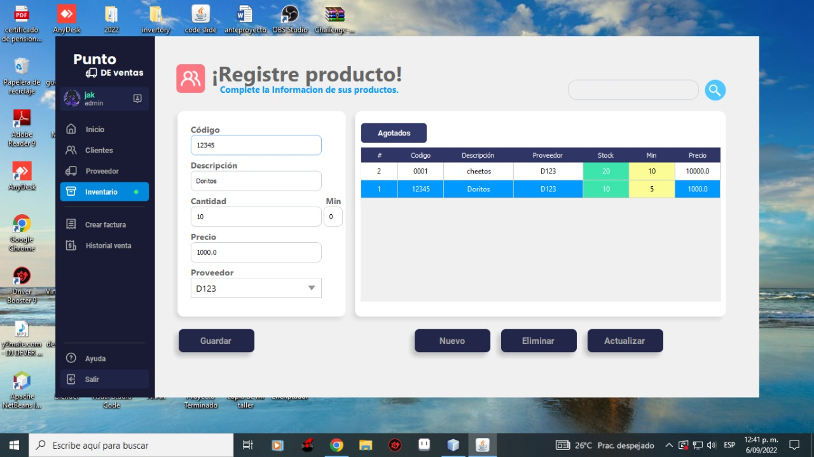

<h2 align="center"> Apartado de ventas</h2>

 En este apartado puedes realizar las `ventas`, se necesita ingresar el `nit o documento` del usuario para autocompletar los demás datos al igual que también se debe ingresar el `producto`, en este caso cada producto cuenta con un `código.` Una vez de haber completado estos requisitos se podrá realizar la venta que inmediatamente generará una `factura.`

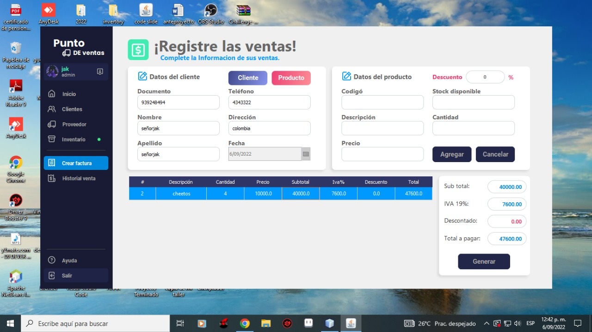

<h2 align="center">Factura o reporte de venta</h2>

 Cada venta realizada generará una `factura` o `reporte` de inmediato, aquí se puede observar los detalles de la venta que ha sido realizada, como la información del `cliente` y el `producto` al igual que nos muestra también que usuario fue el que realizó dicha `venta` y en qué fecha.

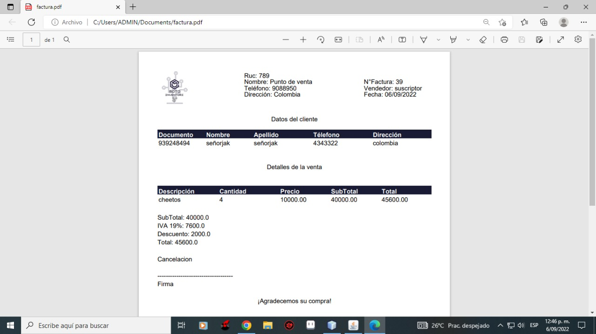

<h2 align="center">Historial de ventas</h2>

 En este apartado se encuentran todas las ventas que fueron `realizadas`, aquí se puede visualizar mostradanos su reporte dándole `click` al botón `imprimir`, también cuenta así con la disponibilidad de poder `eliminar` la.

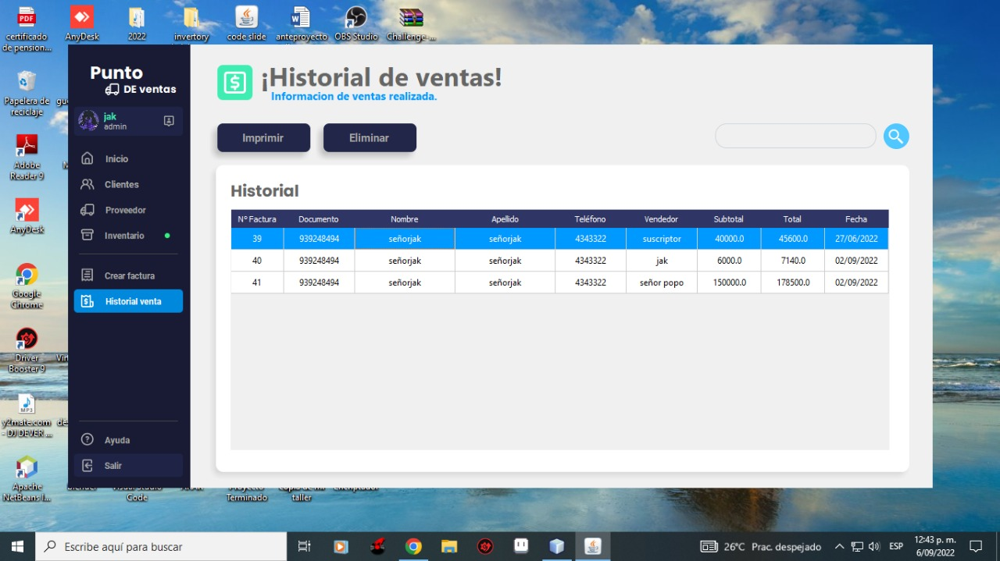

<h2 align="center"> Ayuda</h2>

 En este apartado se encuentra una pequeña `información` de lo que puede ayudar al usuario en aclarar las dudas o problemas que tenga con el manejo de la aplicación.

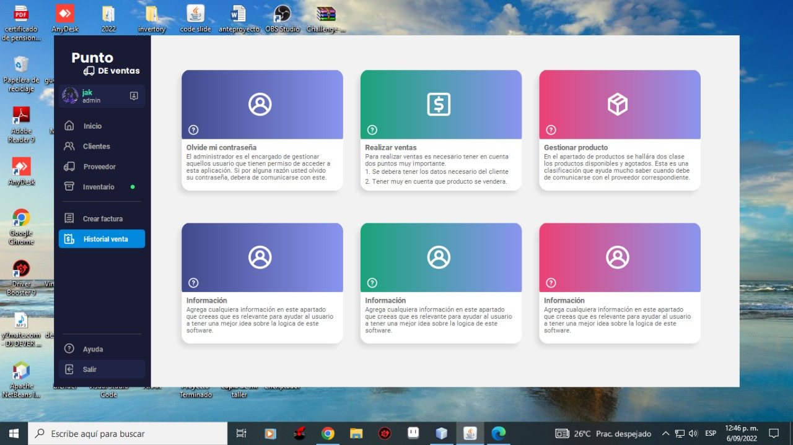

<h2 align="center"> Rol de usuario</h2>

 En el control de `usuario` podemos hacer el registro de usuarios nuevos administrandolos con el rol que nosotros le queramos dar. En este apartado solo puede acceder el `admin` o los que cumplan con ese rol, mientras que aquellos usuario que tienen el rol de `empleado` no pueden acceder a este apartado como también a otros que se hayan bloqueado con un candado.

> **Admin**

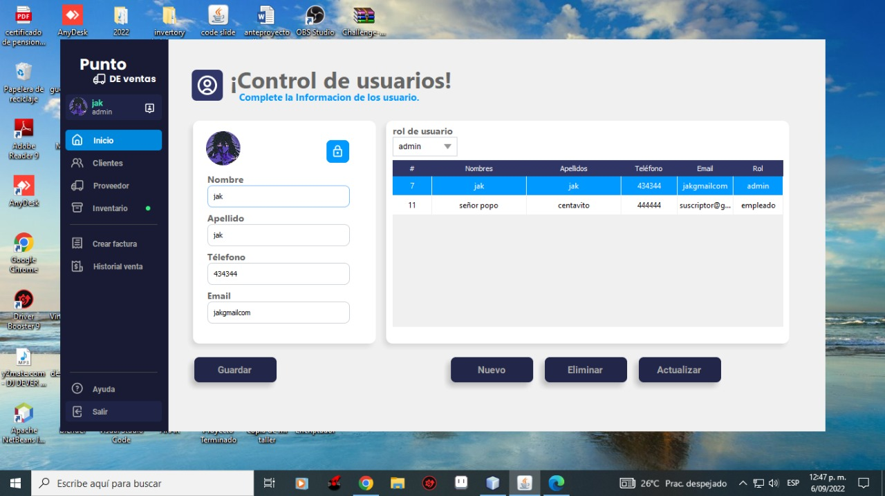
> **Empleado**

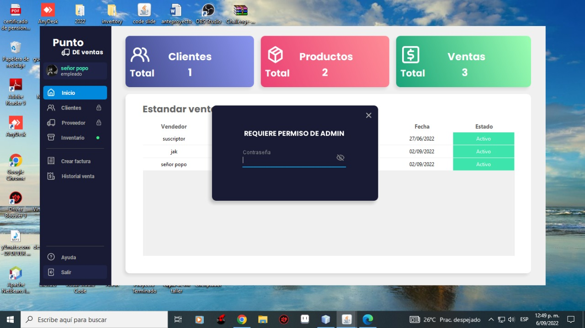
